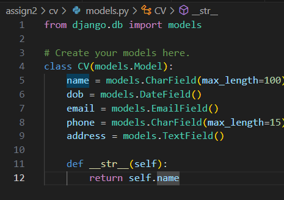
### First define the cv, it includes name, date of birth, phone number, email, address.
---
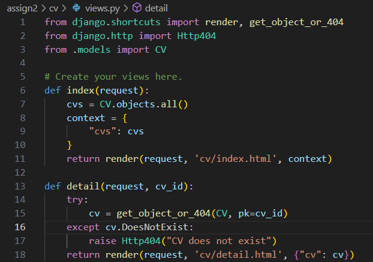
### Change the views, include index -- which will show cvs, and detail -- which will show the details of a cv.
---
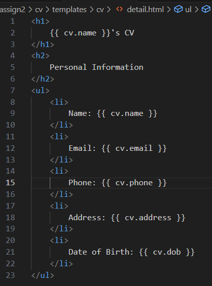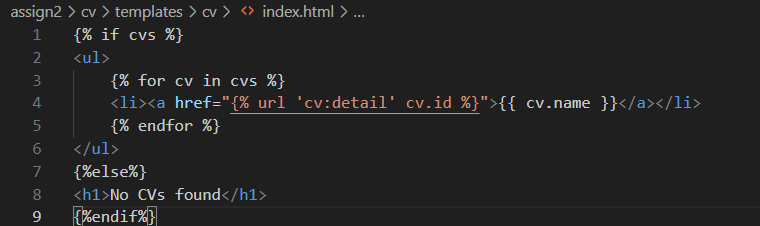
### Revelant html files, detail.html and index.html
---
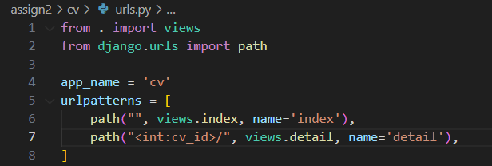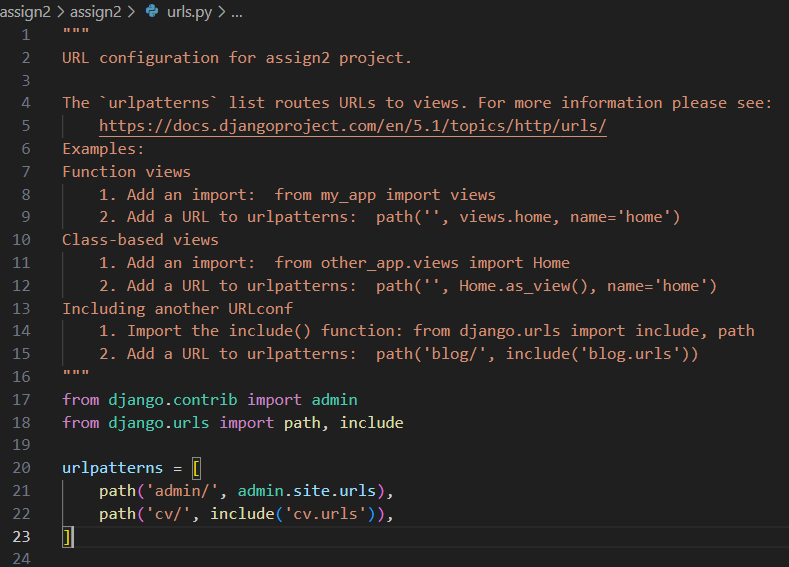
### Add urls in assign2/cv/urls.py and assign2/urls.py
---
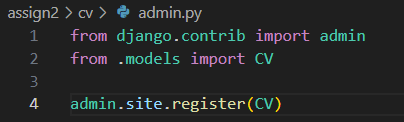
### Register cv in admin.py so that we can add cv from admin panel.
---
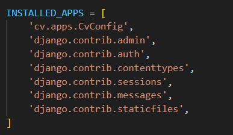
### Add cv app in settings.py.
---
### Make migrations and migrate. Create superuser. Create cv from admin panel.
#### (I have done all of these, but forgot to take screenshots......)
---
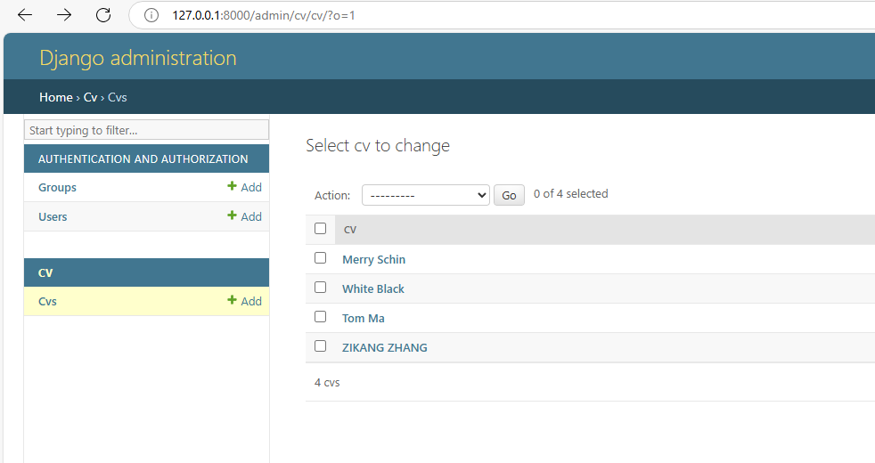
### I created several cvs, and now I can see them in the index page.
---
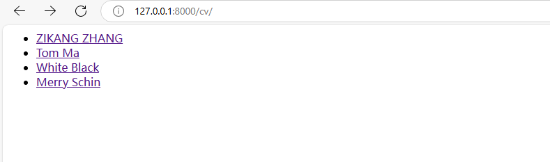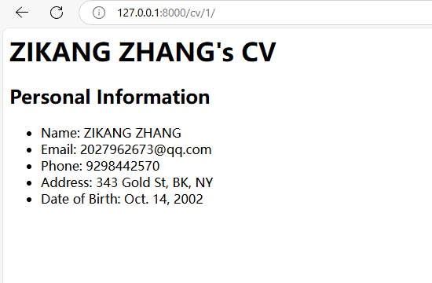
### Run the server and check the index page and detail page.